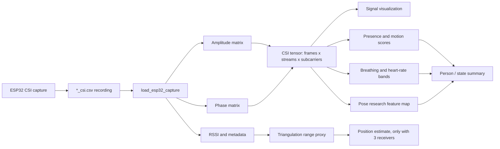
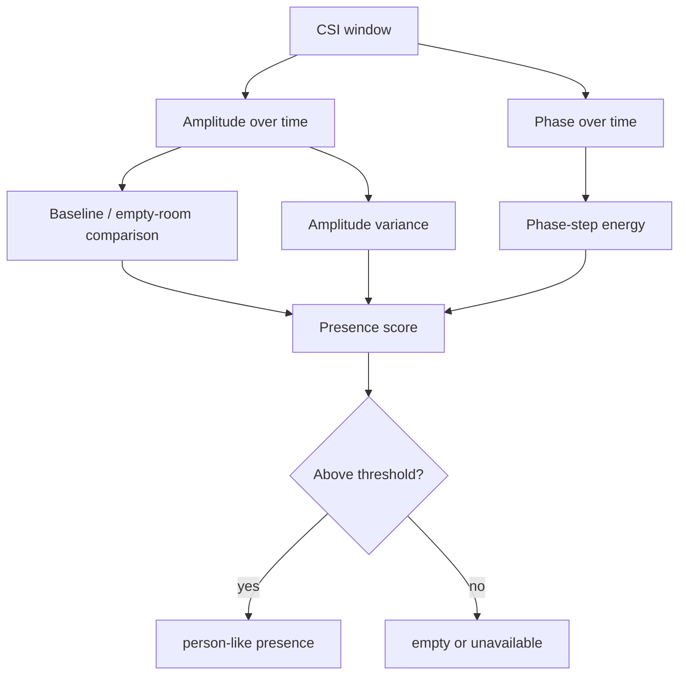
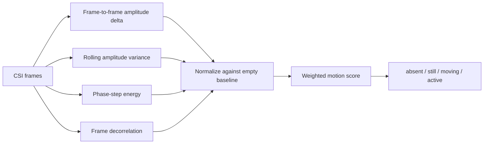
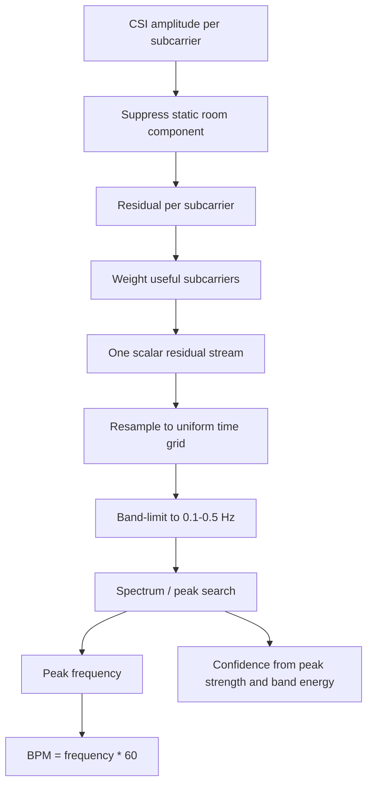
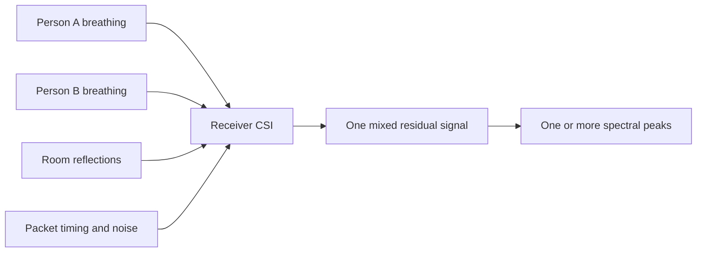
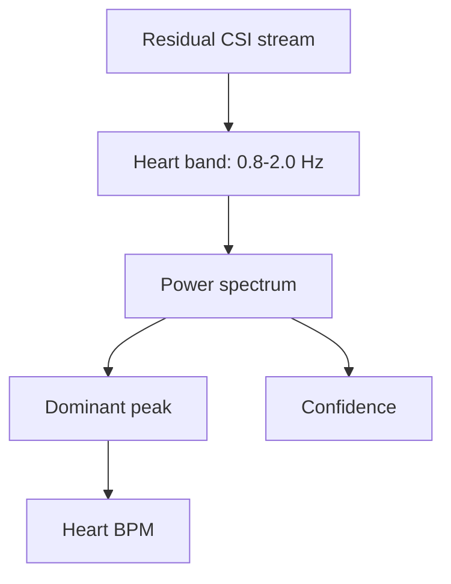
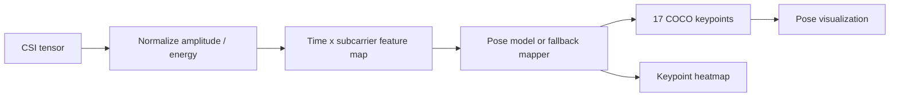
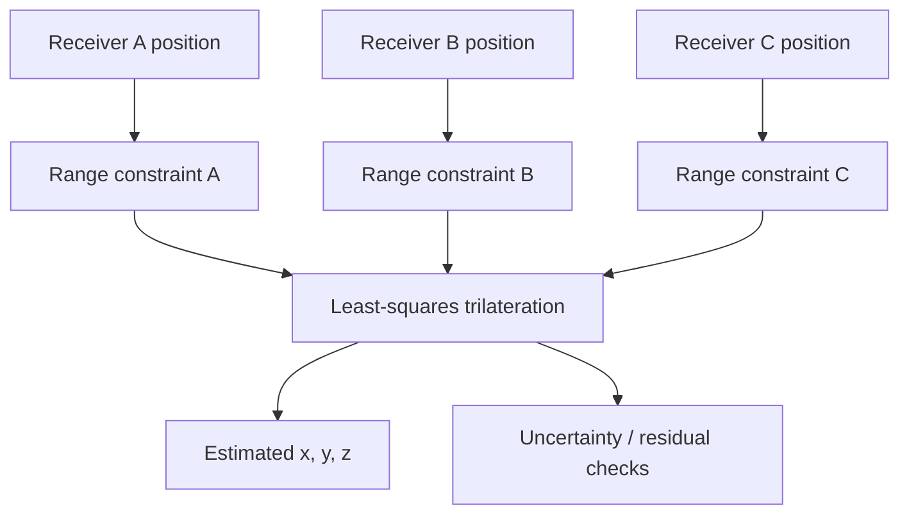
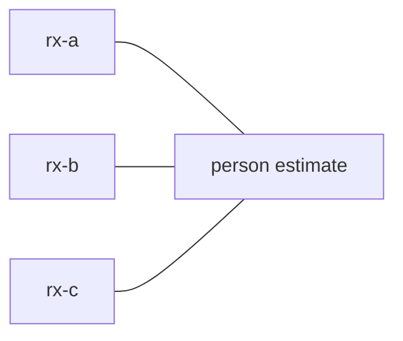
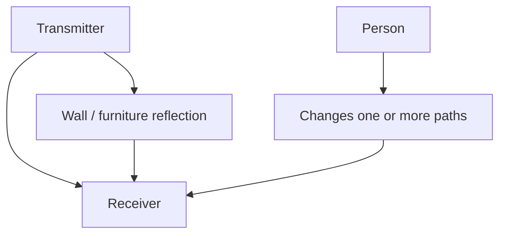

# RuView Detection Workings

This document explains how the current RuView Python research port treats CSI
recordings for signal visualization, person detection, motion detection,
breathing rate, heart rate, pose estimation, and the proposed three-receiver
position workflow.

It is written for a first pass through the repo. The notebooks are the easiest
place to inspect each stage interactively; the code under `src/ruview/` provides
the reusable parsing and signal-processing pieces.

## Notebook Entry Points

| Scope | Notebook |
|---|---|
| End-to-end capture, visualization, prediction | `notebooks/00_end_to_end_capture_visualization_prediction.ipynb` |
| Amplitude and phase visualization | `notebooks/01_signal_amplitude_phase_visualization.ipynb` |
| Subcarrier heatmaps | `notebooks/02_signal_subcarrier_heatmaps.ipynb` |
| Person / presence detection | `notebooks/03_person_presence_detection.ipynb` |
| Motion detection | `notebooks/04_motion_detection.ipynb` |
| Breathing and heart-rate detection | `notebooks/05_breathing_heart_rate_detection.ipynb` |
| Pose estimation | `notebooks/06_pose_estimation.ipynb` |
| Local recording triage | `notebooks/07_recording_presence_breathing_triage.ipynb` |
| Three-receiver position triangulation | `notebooks/08_position_triangulation_three_receivers.ipynb` |

Every notebook has a source switch near the top:

```python
USE_RECORDING = False
RECORDING_CSV = None
```

Set `USE_RECORDING = True` to load a local `*_csi.csv` capture. Leave
`RECORDING_CSV = None` to auto-pick the first file under `data/recordings/`, or
set it to a specific CSV path.

The triangulation notebook is different because a single receiver cannot
triangulate a person. It uses:

```python
RECEIVER_RECORDINGS = {
    "rx-a": "/path/to/rx-a_csi.csv",
    "rx-b": "/path/to/rx-b_csi.csv",
    "rx-c": "/path/to/rx-c_csi.csv",
}
```

## Overall Data Pipeline

At a high level, the repo turns packet-level CSI into a time-series tensor, then
runs task-specific feature extraction on that tensor.



The important shape is:

```text
frames x streams x subcarriers
```

For ESP32 CSV recordings in this repo, the loader usually produces one stream
per receiver file:

```text
frames x 1 x subcarriers
```

The synthetic notebook fixtures often use several streams to simulate multiple
receivers or antennas:

```text
frames x 3 x subcarriers
```

## What The Raw Data Means

CSI is a per-subcarrier complex channel measurement:

```text
CSI = amplitude * exp(i * phase)
```

The repo keeps these pieces separate because different tasks care about
different signatures.

| Signal | What changes when a person affects the channel |
|---|---|
| Amplitude | Reflections and blockage change received power on some subcarriers. |
| Phase | Small body motion changes path length, causing phase drift or oscillation. |
| RSSI | Coarse received power changes; useful as a rough range proxy, not a precise distance. |
| Subcarrier variance | Motion often appears as localized variance over time and frequency. |
| Temporal periodicity | Breathing and heart motion appear as low-amplitude periodic components. |

## Person Presence Detection

Presence is not a camera-like direct observation. The detector looks for a room
state that differs from a baseline: higher amplitude structure, higher variance,
or more temporal disturbance in CSI.



In the notebooks:

- `03_person_presence_detection.ipynb` compares an empty baseline against a
  person-present segment.
- In recording mode, it uses an early segment as a baseline and compares it
  with the highest-motion segment.
- `07_recording_presence_breathing_triage.ipynb` runs the current capture
  analyzer and reports the windowed presence summary.

This can detect line-of-sight blockage, Fresnel-zone disturbance, and multipath
reflection changes. The person does not need to stand exactly between
transmitter and receiver, but the detection is strongest when the person affects
dominant paths.

## Motion Detection

Motion detection asks whether the CSI is changing quickly enough to imply body
movement. It is related to presence but not identical: a still person can create
presence without a high motion score.



The current notebook logic uses simple, inspectable features:

- rolling amplitude variance;
- frame-to-frame difference energy;
- phase-step energy;
- correlation drop between consecutive frames.

The output is a score, not a semantic activity classifier. Real thresholds need
empty-room and labeled movement recordings from the actual room.

## Breathing Rate Detection

Breathing is a periodic micro-motion problem. A chest moving in and out changes
path lengths by a small amount. That creates low-frequency oscillations in CSI
amplitude or phase.

Expected breathing band:

```text
0.1 Hz to 0.5 Hz = 6 to 30 breaths per minute
```

### Breathing Pipeline



In code terms, the notebook does this:

1. Load amplitude rows from the capture.
2. Fill invalid subcarrier values with column means.
3. Run an exponential moving average preprocessor.
4. Subtract the slow static estimate to get residual motion.
5. Collapse the residual across subcarriers.
6. Resample irregular packet times onto a uniform grid.
7. Search the breathing band for the dominant peak.
8. Report BPM, confidence, and quality.

The original RuView paths vary by runtime:

| Runtime | Breathing method |
|---|---|
| Original standalone vitals crate | EMA residuals, subcarrier fusion, 0.1-0.5 Hz filtering, zero-crossing / spectral logic. |
| Original sensing server | Mean-amplitude buffer, FIR bandpass, FFT peak detection. |
| Python port | EMA residuals plus NumPy/SciPy spectral peak detection and confidence scoring. |

### Why Multiple People Are Hard

With one scalar residual stream, multiple breathers mix together:



If two people breathe at different rates, the spectrum may show multiple peaks.
That still does not tell us which peak belongs to which person or where either
person is. To separate people, the system needs more independent observations:

- multiple receivers or antennas;
- stable per-link streams;
- known receiver geometry;
- beamforming, tomography, blind source separation, or tracking over time;
- enough packet rate and duration to resolve nearby frequencies.

So the current notebooks can show candidate peaks, but they do not claim
multi-person vital-sign identity.

## Heart Rate Detection

Heart-rate detection is similar to breathing detection but weaker. The motion is
smaller and the frequency band is higher.

Expected heart-rate band:

```text
0.8 Hz to 2.0 Hz = 48 to 120 beats per minute
```



The current Python path is research-grade:

- it is useful for visualizing whether a heart-band peak exists;
- it is sensitive to motion artifacts, packet timing, and multipath;
- it is not a clinical heart-rate estimator.

In real captures, heart rate usually needs better-controlled geometry and
cleaner data than breathing.

## Pose Estimation

Pose estimation in this repo is a research scaffold, not a trained production
model. The notebooks convert CSI into a feature map and then run a fallback
COCO-style keypoint generator so the downstream data shape can be inspected.



The important output signature is:

```text
17 keypoints x (x, y, confidence)
```

The fallback notebook output should be interpreted as a shape and workflow
check. Real pose estimation would require a trained CSI-to-pose model and
paired ground-truth labels.

## Person Position And Triangulation

Presence detection says "someone probably affected the radio channel."
Triangulation asks "where is that person?"

Those are different problems.

One receiver link is underdetermined. It can show that the channel changed, but
many different body positions can produce similar CSI changes.

With three receiver range estimates, position can be solved geometrically:



Room sketch:



The current triangulation notebook does two things:

1. It demonstrates the geometry with synthetic receiver positions and synthetic
   range measurements.
2. It has a recording-backed path where three receiver CSVs can be converted
   into rough RSSI-derived range constraints.

The second path is only a starting point. RSSI-to-distance is noisy indoors and
needs calibration. For defensible position detection, collect synchronized
multi-receiver data in the same room, survey the receiver coordinates, and tune
the range or fingerprint model against known person locations.

## Line Of Sight Versus Multipath

Detection is not only possible when the person is directly between transmitter
and receiver.



A person can be detected when they:

- block or attenuate the direct path;
- move inside a Fresnel zone around the direct path;
- change a strong reflected path;
- create new reflections that alter subcarrier amplitude or phase.

However, the farther the person is from dominant paths, the weaker and less
stable the signature becomes. This is why a single link can often detect a
change but cannot uniquely localize the person in 3D.

## Practical Workflow

For a new recording:

1. Open `00_end_to_end_capture_visualization_prediction.ipynb`.
2. Set `RECORDING_CSV` to the capture you want, or leave it as `None`.
3. Run all cells and check RSSI, amplitude heatmap, phase heatmap, presence
   score, motion score, and breathing residual plots.
4. Open `07_recording_presence_breathing_triage.ipynb` for a deeper breathing
   check. Compare dominant-link output against mixed all-packets output.
5. Use `01` and `02` when you only want signal visualization.
6. Use `03`, `04`, and `05` when you want focused detector notebooks.
7. Use `08` only when you have three receiver recordings for the same scene.

## Current Caveats

- The current presence and motion outputs are heuristic scores.
- Breathing and heart-rate estimates are research diagnostics, not medical
  measurements.
- Multiple-person breathing separation is not solved by a single mixed CSI
  stream.
- Pose estimation is a scaffold unless a trained model and labeled CSI/pose
  dataset are added.
- Three-dimensional position needs calibrated multistatic data; one receiver is
  not enough.
- Real deployment thresholds must be tuned with empty-room baselines and labeled
  captures from the target room.
